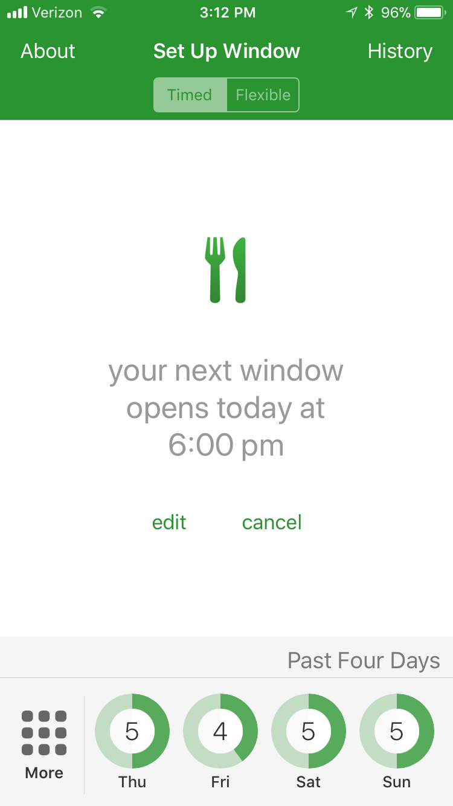
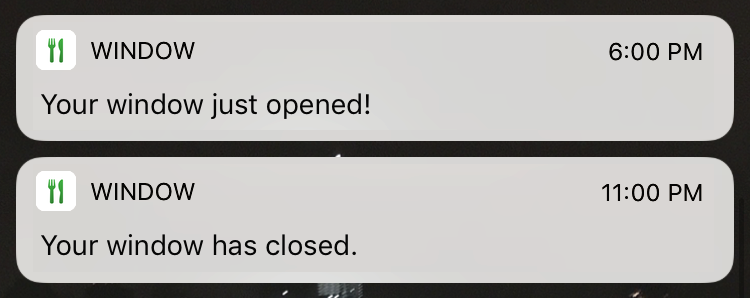

## Contents

 - [Opening an Eating Window](#opening-an-eating-window)
   - [Timed vs Flexible Windows](#timed-vs-flexible-windows)
- [Scheduling a Daily Window](#scheduling-a-daily-window)

# Opening an Eating Window

Once you open the Window app, you'll see a screen that lets you set up and open an eating window. In the center of the screen, you can use the plus and minus buttons to set the length the length of your eating window.

    
    

When you're ready to open your eating window, you can press the green "Open Now" button. The app will start showing you a countdown ticking down towards the end of your eating window. Once your eating window is over, you will receive a notification.

    

## Timed vs Flexible Windows

If you don't want to set a specific duration for your eating window up-front, you can use a **flexible** window. Instead of closing automatically after a set amount of time, a flexible window stays open until you close it manually.

To use a flexible window, change the window type to "Flexible" in the switch at the top of the setup screen.

    
    

 

# Scheduling a Daily Window

You can set a schedule for your eating windows so they will automatically open and close at the same time every day. If you tap the gray "Schedule" button on the setup screen, you'll see a screen where you can configure your daily schedule.

The length of window (included whether the window is timed of flexible) is pulled from the main setup screen. You can set the start time of the eating window. At that time, your window will open and you'll receive a notification. 

You can either set a schedule that repeats every day, or schedule an individial window to start later that day.

Once you're happy with your schedule, you can tap the "Schedule" button and Window will take it from there.

    
    

 

When your eating windows open or close, you'll always get a notification.

    

# More coming soon!