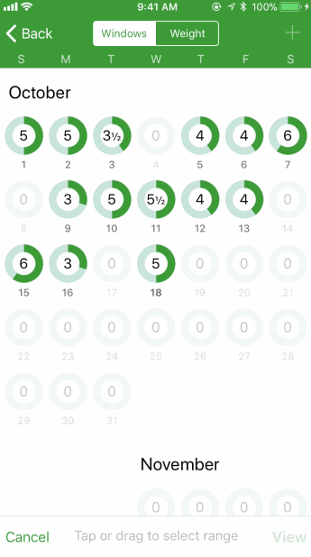
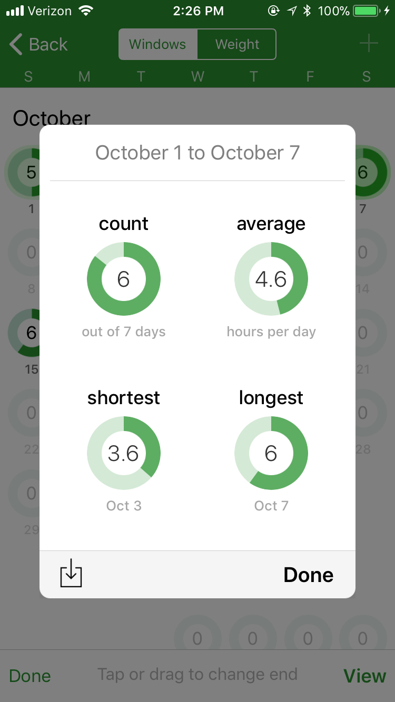
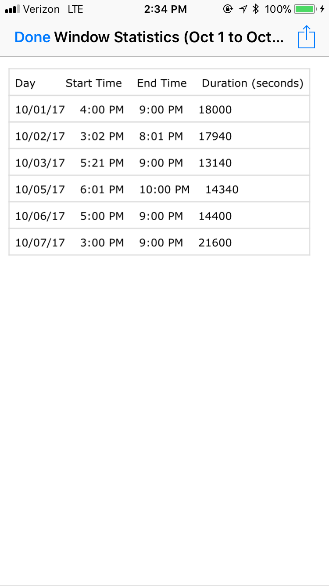

## Contents

- **[Opening an Eating Window](#opening-an-eating-window)**
   - [Timed vs Flexible Windows](#timed-vs-flexible-windows)
   - [Scheduling a Daily Window](#scheduling-a-daily-window)
- **[Viewing your Window History](#viewing-your-window-history)**
   - [Viewing your Fasting Duration](#viewing-your-fasting-duration)
   - [How does Window calculate your Fasting Duration?](#how-does-window-calculate-your-fasting-duration)
   - [Viewing Statistics about your Windows](#viewing-statistics-about-your-windows)
   - [Exporting your Window History to a Spreadsheet](#exporting-your-window-history-to-a-spreadsheet)
- **[Adding a Note to your Window](#adding-a-note-to-your-window)**
  - [Adding an Image to Your Note](#adding-an-image-to-your-note)
  - [Viewing Past Notes](#viewing-past-notes)
- **[Tracking your Weight with Window](#tracking-your-weight-with-window)**
    - [Granting HealthKit Access](#granting-health-kit-access)
    - [Logging your Weight](#logging-your-weight)
    - [Managing the Weight Graph](#managing-the-weight-graph)
    - [Hiding Old Weights](#hiding-old-weights)

# Opening an Eating Window

Once you open the Window app, you'll see a screen that lets you set up and open an eating window. In the center of the screen, you can use the plus and minus buttons to set the length of your eating window.

    
    

When you're ready to open your eating window, you can press the green "Open Now" button. The app will start showing you a countdown ticking down towards the end of your eating window. Once your eating window is over, you will receive a notification.

    

## Timed vs Flexible Windows

If you don't want to set a specific duration for your eating window up-front, you can use a **flexible** window. Instead of closing automatically after a set amount of time, a flexible window stays open until you close it manually.

To use a flexible window, change the window type to "Flexible" in the switch at the top of the setup screen.

    
    

 

## Scheduling a Daily Window

You can set a schedule for your eating windows so they will automatically open and close at the same time every day. If you tap the gray "Schedule" button on the setup screen, you'll see a screen where you can configure your daily schedule.

The length of your eating window (included whether the window is timed of flexible) is pulled from the main setup screen. You can set the start time of the eating window by using the up and down arrows.

You can either set a schedule that repeats every day, or schedule an individial window to start later that day.

Once you're happy with your schedule, you can tap the "Schedule" button and Window will take it from there.

    
    

 

With scheduled eating windows, you get a notification when the window opens and when the window closes. If you're using a repeating schedule, the notifications will repeat every day.

    

# Viewing your Window History

You can view your recent eating windows at the bottom of the main setup screen. If you want to view windows older than that, you can tap the "More" button at the bottom left to open the Window History screen.

On the Window History screen, you can see all of your past eating windows in a calendar format. The number inside each circle is the length of that day's eating window (rounded to the nearest half-hour).

    
    

## Viewing your Fasting Duration

Even though your eating window tracks the amount of time you eat, you can also view the amount of time you *don't* eat. This is your fasting duration.

You can configure Window to show your fasting duration instead of your eating window duration. Open the [Window History](#viewing-your-window-history) screen, and tap the gear at the bottom of the screen. Then toggle "Show fasting duration".

    
    

## How does Window calculate your Fasting Duration?

Since Window only *tracks* the time you eat, it does a little bit of math to calculate your fasting duration. Window defines your *"fasting duration"* as the amount of time between the **end** of one eating window and the **start** of the next eating window.

For example, if you have an eating window that ends at 9pm on one day, and an eating window that starts at 3pm on the next day, then you fasted for 18 hours.

    

If you are currently fasting, Window will calculate your fast as being the time since your most recent eating window. For example, if your most recent eating window ended at 3pm and it's currently 9pm, then Window will say that you've been fasting for 6 hours.

## Viewing Statistics about your Windows

You can view statistics about your eating windows, including average length of your windows over some range of dates. From the [Window History](#viewing-your-window-history) screen, tap the *"Statistics"* button at the bottom-right. 

To select a range of dates, tap the start date and then tap the end date. You can also select dates by dragging your finger across the calendar.

Once you have the correct range selected, tap *"View"* at the bottom-right. Window will show you your statistics for the selected range of dates.

    
    

## Exporting your Window History to a Spreadsheet

If you want to perform more advanced analysis of your eating window history, you can export your data to a spreadsheet.

First, you must [open the statistics screen](#viewing-statistics-about-your-windows) for the specific range of dates you're interested in. Then you can tap the *"Download"* button at the bottom-left of that screen.

Window will generate a *.csv* file of your data. CSV stands for "comma-separated values". Most spreadsheet programs, such as Microsoft Excel or Apple Numbers, can open a *.csv" file. You can add it to a note, email it to yourself, or open it on a different app on your device.

    
    

## Adding a Note to your Window

You can now add notes to your windows (while they're open or even after they're closed). You have space to write about your day, mention how you feel, or log what you ate for dinner. You can also attach pictures, which is the perfect way to document your eating habits. Window will save these notes with your windows forever so you can come back and reference them later.

To add a note to your Window, tap the *"Add Note"* button in the bottom bar of your current window. From there, you can type a note or add an image. Once you're done, tap the *"Save"* button.

    
    

### Adding an Image to Your Note

You can add an image to your note by tapping the green Camera button on the [Note screen](#adding-a-note-to-your-window). You will have the option to either choose an existing photo on your device, or take a photo directly from the camera.

Once you choose a photo, Window will show you a thumbnail of the image on the Note screen. You can tap on that thumbnail to view the image full-screen.

Window will store and remember all of your images so you can view them later.

    
    

### Viewing Past Notes

When you create a new note, it stays attached to the specific Window that it was added to. To view your notes later, you can use the [Window History screen](#viewing-your-window-history). 

Window will show a small pencil icon for each of your eating windows that have a note attached. If you tap on that date, and then tap *"View Note"*, your note will open.

    
    

## Tracking your Weight with Window

Coming soon.

